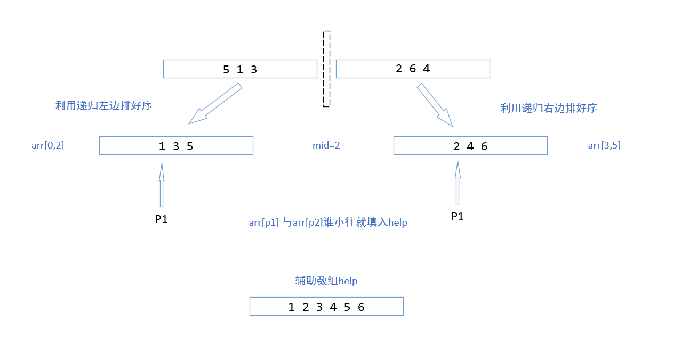

# 排序算法

## 冒泡排序

## 选择排序

## 插入排序

## 希尔排序
### 【简介】
希尔排序是基于插入排序的快速排序算法。对于大规模乱序数组插入排序很慢，因为它只会交换相邻的元素，因此元素只能一点一点地从数组的一端移动到另一端。

### 【原理】
希尔排序的思想是使数组中任意间隔为h的元素都是有序的。这样的数组称为h有序数组。

### 【代码实现】
```java
public class ShellSort {
    public static void sheelSort(int[] arr) {
        int N = arr.length;
        int h = 1;

        if (arr == null || N <= 2) {
            return;
        }
        while (h < N / 3) {
            h = 3 * h + 1;
        }
        while (h >= 1) {
            for (int i = h; i < N; i++) {
                for (int j = i; j >= h && arr[j] < arr[j - h]; j -= h) {
                    swap(arr, j, h);
                }
            }
            h = h / 3;
        }
    }

    public static void swap(int[] arr, int i, int j) {
        arr[i] = arr[i] ^ arr[j];
        arr[j] = arr[i] ^ arr[j];
        arr[i] = arr[i] ^ arr[j];
    }
}
```

## 归并排序
### 【简介】
归并排序（mergesort），是创建在归并操作上的一种有效的排序算法，1945年由约翰·冯·诺伊曼首次提出。该算法是采用分治法（Divide and Conquer）的一个非常典型的应用，且各层分治递归可以同时进行。
$$
时间复杂度: O(N*log^N)
$$

$$
空间复杂度：O(N)
$$
### 【原理】
#### 递归法（Top-down）
1.申请空间，使其大小为两个已经排序序列之和，该空间用来存放合并后的序列
2. 设定两个指针，最初位置分别为两个已经排序序列的起始位置
3. 比较两个指针所指向的元素，选择相对小的元素放入到合并空间，并移动指针到下一位置
4. 重复步骤3直到某一指针到达序列尾
5. 将另一序列剩下的所有元素直接复制到合并序列尾


### 【代码实现】
```java
public class MergeSort {

    public static void mergeSort(int[] arr) {
        if (arr == null || arr.length < 2) {
            return;
        }
        sortProcess(arr, 0, arr.length - 1);
    }

    public static void sortProcess(int[] arr, int L, int R) {
        if (L == R) {
            return;
        }
        // L和R中点的位置  等同于与(L + R ) /2
        int mid = L + ((R - L) >> 1);
        sortProcess(arr, L, mid);
        sortProcess(arr, mid + 1, R);
        merge(arr, L, mid, R);
    }

    public static void merge(int[] arr, int L, int mid, int R) {
        int[] help = new int[R - L + 1];
        int i = 0;
        //左边数组的游标
        int p1 = L;
        //右边数组的游标
        int p2 = mid + 1;
        //左右两个数组通过比较下标，较小值放入辅助数组中进。直到一边到头
        while (p1 <= mid && p2 <= R) {
            help[i++] = arr[p1] < arr[p2] ? arr[p1++] : arr[p2++];
        }
        // 两个必有且只有一个越界
        while (p1 <= mid) {
            help[i++] = arr[p1++];
        }
        while (p2 <= R) {
            help[i++] = arr[p2++];
        }
        //将辅助数组拷贝会原数组
        for (int j = 0; j < help.length; j++) {
            arr[L + j] = help[j];
        }

    }
}

``` 
