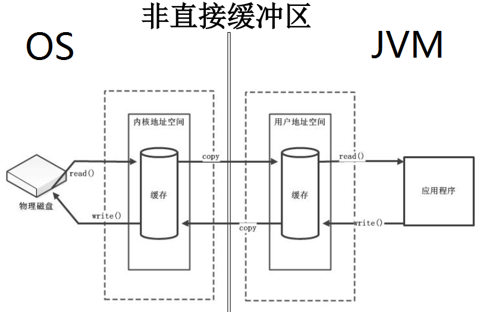
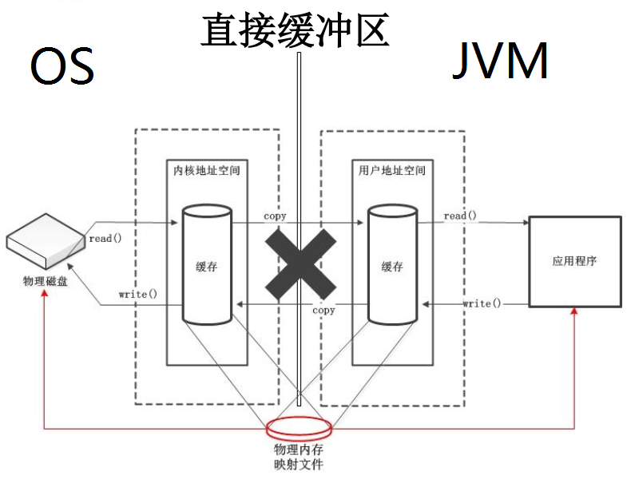

[toc]

# NIO

## 1. Java NIO简介
Java NIO(New IO Non-Blocking IO(非阻塞式))是从Java1.4版本开始引入的新的IO API，可以替代标准的Java IO API。NIO与原来的IO有同样的作用和目的，但是使用的方式完全不同，NIO支持面向缓冲区的、基于通道的IO操作。NIO将以更加高效的方式进行文件的读写操作。

## 2. Java NIO 与 IO 的主要区别
IO  |   NIO
-- | --
面向流(Stream Oriented) | 面向缓冲区(Buffer Oriendted)
阻塞IO(Blocking IO) | 非阻塞IO(Non blocking IO)
无 | 选择器(Selectors)

## 3. 缓冲区(buffer)和通道(Channel)
Java NIO系统的核心在于：通道(Channel)和缓冲区(Buffer)。通道表示打开到IO设备(例如：文件、套接字)的连接。若需要使用NIO系统，需要获取用于连接设备的通道以及用于容纳数据的缓冲区。然后操作缓冲区，对数据进行处理。总的来说，Channel负责传输，Buffer负责存储.

### 3.1 缓冲区
在Java NIO中负责数据的读取，缓冲区就是数组，用于存储不同类型的数据
根据数据类型的不同(boolean除外),提供了相应类型的缓冲区：
- ByteBuffer
- CharBuffer
- ShortBuffer
- IntBuffer
- FloatBuffer
- DoubleBuffer
- LongBuffer
- MappedByteBuffer

 
上述Buffer类它们都采用相似的方法进行管理数据，知识各自管理的数据类型不同而已。都是用过如下方法获取一个Buffer对象：


### 3.2 缓冲区中的四个核心属性
- mark(标记)：记录当前position位置，可以通过reset()恢复到mark的位置
- position(位置)：表示缓冲区正在操作数据的位置
- limit(界限)：表示缓冲区中可以以操作数据的大小。(limit 后数据不能进行读写)
- capacity(容量)：表示缓冲区中最大存储数据的容量，一旦声明不能改变。

Invariants: mark <= position <= limit <= capacity

上述缓冲你去的管理方式几乎一致，通过allocate()获取缓冲区。


### 3.3 Buffer的常用方法
方法 | 描述
-- | --
Buffer clear() | 清空缓冲区并返回对缓冲的引用
Buffer flip() | 将缓冲区的界限设置为当前位置，并将当前位置设置为0
int capacity() | 返回Buffer的capacity的大小
boolean hasRemaining() | 判断缓冲区中是否还有元素
int limit() | 返回Buffer 的界限(limit)的位置
Buffer limit(int n) | 将设置缓冲区界限为n,并返回一个具有新limit的缓冲区对象
Buffer mark() | 对缓冲区设置标记
int position() | 返回缓冲区的当前位置position
Buffer position(int n) | 将设置缓冲区的当前位置为n，并返回修改后的Buffer对象
int remaining() | 返回position转到以前设置的mark所在的位置
Buffer reset() | 将设置position转到以前设置的mark所在的位置
Buffer rewind() | 将设置为0，取消设置的mark

### 缓冲区的数据操作
Buffer所有子类提供了两个用于数据操作的方法：get()与put() 方法
- 获取Buffer中的数据
    - get(): 读取单个字节
    - get(byte[] dst): 批量读取多个字节到dst中
    - get(int index): 读取指定索引位置的字节(不会移动position)

- 读取数据到Buffer中
    - put(byte b): 将给定单个字节写入缓冲区的当前位置
    - put(byte[] src): 将src中的字节写入缓冲区的当前位置
    - put(int index,byte b): 将指定字节写入缓冲区的索引位置(不会移动position)


### 直接缓冲区与非直接缓冲区
- 非直接缓冲区：通过allocate()方法分配缓冲区，将缓冲区简历在JVM的内存中
- 直接缓冲区：通过allocateDirect() 方法分配在直接缓冲区，将缓冲区简历在屋里内存中，可以提高效率。

- 字节缓冲区要么是直接的，要么是非直接的。如果为直接字节缓冲区，则Java虚拟机会尽最大努力在此缓冲区上执行本机I/O操作。也就是说，在每次调用基础操作系统的一个I/O操作之前(或之后)，虚拟机都会尽量避免将缓冲区的内容复制到中间缓冲区中(或从中间缓冲区中复制内容)。
- 直接字节缓冲区可以通过调用此类的**allocateDirect()工厂方法**来创建。此方法返回**缓冲区进行分配和取消分配所需成本通常高于非直接缓冲区**。直接缓冲区的内容可以驻留在常规的垃圾回收堆之外，因此，它们堆应用程序的内存需求造成的影响可能并不明显。所以，建议将直接缓冲区主要分配给那些易受基础系统本机I/O操作影响的大型、持久的缓冲区。一般情况下，最好仅在直接缓冲区能在程序性方面带来明显好处时分配它们。
- 直接字节缓冲区还可以通过FileChannel的map()方法将我呢见区域直接映射到内存中来创建。该方法返回**MappedByteBuffer**。java平台的实现有助于通过JNI从本机代码创建直接字节缓冲区。如果以上这些缓冲区中的某个缓冲区实例指的是不可以访问的内存区域，则驶入访问该区域不会更改该缓冲区的内容，并且将会在访问期间或稍后的某个时间导致抛出不确定的异常。
- 字节缓冲区是直接缓冲区还是非直接缓冲区可通过调用器**isDirect()** 方法来确定。提供此方法是为了能够在性能关键型代码中显式缓冲区管理。
#### 非直接缓冲区

##### 源码解析
```java
    public static ByteBuffer allocate(int capacity) {
        if (capacity < 0)
            throw new IllegalArgumentException();
        return new HeapByteBuffer(capacity, capacity);
    }
``` 
这里我们可以看到申请的是堆空间，我们再点进去
```java
    HeapByteBuffer(int cap, int lim) {            // package-private

        super(-1, 0, lim, cap, new byte[cap], 0);
        /*
        hb = new byte[cap];
        offset = 0;
        */
        
    }
```
从这里我们可以看到实际上是 byte数组

#### 直接缓冲区



##### 源码解析
通过allocateDirect方法 申请直接缓冲去
```java
    public static ByteBuffer allocateDirect(int capacity) {
        return new DirectByteBuffer(capacity);
    }
``` 
我们再看DirectByteBuffer的构造方法
```java
DirectByteBuffer(int cap) {                   // package-private

        super(-1, 0, cap, cap);
        boolean pa = VM.isDirectMemoryPageAligned();
        int ps = Bits.pageSize();
        long size = Math.max(1L, (long)cap + (pa ? ps : 0));
        Bits.reserveMemory(size, cap);

        long base = 0;
        try {
            base = unsafe.allocateMemory(size);
        } catch (OutOfMemoryError x) {
            Bits.unreserveMemory(size, cap);
            throw x;
        }
        unsafe.setMemory(base, size, (byte) 0);
        if (pa && (base % ps != 0)) {
            // Round up to page boundary
            address = base + ps - (base & (ps - 1));
        } else {
            address = base;
        }
        cleaner = Cleaner.create(this, new Deallocator(base, size, cap));
        att = null;
        
    }
```
可以看到unsafe.allocateMemory(size)，已经不能进入源码了，它已经是操作系统层面的jni调用了。

## 4. 文件通道(FileChannel)
由java.nio.channels包定义的。Channel表示IO源与目标打开的连接。Channel类似于传统的“流”。只不过Channel本身不能直接访问数据，Channel只能于buffer进行交互。（类似于铁轨，缓冲区类似于火车） 

- Channel 与 流的区别
    - 通道可以异步读写
    - 通道总是基于缓冲区Buffer来读写
    - 通道可以读也可以写，流一般来说是单向的(只能读或者写，所以之前我们用流进行IO操作的时候需要分别创建一个输入流和一个输出流)

### 4.1 主要通道的实现类
- FileChannel: 用于文件的数据读写
- SocketChannel：基于TCP的数据读写，一般是客户端的实现
- ServerSocketChannel： 允许我们监听TCP连接请求，每个请求会创建一个SocketChannel，一般是服务器实现
- DtagramChannel：用于UDP的数据读写

#### FileChannel的使用
```java
   public void testChannel(){
        FileInputStream fis = null;
        FileOutputStream fos = null;
        FileChannel inChannel = null;
        FileChannel outChannel = null;
        try {
            fis = new FileInputStream("hello.txt");
            fos = new FileOutputStream("hello2.txt");

            //1. 获取通道
            inChannel = fis.getChannel();
            outChannel = fos.getChannel();

            //2.分配指定大小的缓冲区
            ByteBuffer buf = ByteBuffer.allocate(1024);

            //3. 将通道中的数存入缓冲区中
            while ((inChannel.read(buf)) != -1) {
                //切换读取数据的模式
                buf.flip();
                //4 将缓冲区中的数据写入通道
                outChannel.write(buf);
                //清空缓冲区
                buf.clear();

            }
        } catch (IOException e) {
            e.printStackTrace();
        } finally {
            if (outChannel != null){
                try {
                    outChannel.close();
                } catch (IOException e) {
                    e.printStackTrace();
                }
            }
            if (inChannel != null){
                try {
                    inChannel.close();
                } catch (IOException e) {
                    e.printStackTrace();
                }
            }
            if (fis != null){
                try {
                    fos.close();
                } catch (IOException e) {
                    e.printStackTrace();
                }
            }
            if(fos != null){
                try {
                    fis.close();
                } catch (IOException e) {
                    e.printStackTrace();
                }
            }
        }

    }
``` 
### 4.2 获取通道
1. Java 针对支持通道的类提供了getChannel()方法
    - 本地IO：
        - FileInputStream / FileOutputStream
        - RandomAccessFile
    - 网络IO：
        - Socket
        - ServerSocket
        - DatagramSocket
2. 在JDK 1.7 中的NIO 2 针对各个通道提供了静态方法open()
3. 在JDK 1.7 中的NIO 2 的Files 工具类的newByteChannel()

### 4.3 通道之间的数据传输
在Java NIO中如果一个channel是FileChannel类型的，那么它可以直接把数据传输到另一个channel

- transferFrom()：把数据从通道传输到FileChannel
- rransferTo()： 把FileChannel数据传输到另一个Channle

### 4.4 分散(Scatter)与聚集(Gather)
- 分散读取(Scattering Reads): 将通道中的数据分散到多个缓冲区中
- 聚集写入(Gathering Writers):  将多个缓冲区的数据聚集到通道中

### 4.5 字符集
- 编码：字符串 -> 字符数组
- 解码：字符数组 -> 字符串


## 5. NIO 的非阻塞式网络通讯
### 阻塞与非阻塞
- 传统的IO流都是阻塞式的。也就是说，当一个线程调用read()或write()时，该线程被阻塞，直到有一些数据被读取或写入，该线程在此期间不能执行其他任务。因此，在完成网络通讯进行IO操作时，由于线程会阻塞，所以服务器端必须腰围每个客户端提供一个独立的线程进行处理，当服务器需要处理大量客户端时，性能急剧下降。
- Java NIO是非阻塞模式的。当线程当某通道进行读写数据时，若没有数据 可用时，该线程可以进行其他任务。线程通常将非阻塞IO的空闲时间用于在其他通道上执行IO操作，所以单独的线程可以管理多个输入和输出通道。因此，NIO可以让服务端使用一个或有限几个线程来同时处理连接到服务端的所有客户端。

###  选择器(Selector)
选择器是SelectableChannel对象的多路复用器，Selector可以同时监控多个SelectableChannel的IO状态，也就是说，里游泳Selector**可以使一个段都线程管理多个Channel。Selector是非阻塞IO的核心**。
好处就是：使用更少的线程来就可以来处理通道了，相比于使用多个线程，避免了线程上下文切换带来的开销。

#### 选择器的应用
- 创建Selctor：通过调用Selector.open()方法创建一个Selector。
```java
Selector selector = Selector.open();
``` 
- 向选择器注册通道：SelectableChanel.register(Selector sel,int ops)
```java
//创建一个Socket套接字
Socket socket = new Socket(InetAddress.getByName("127.0.0.1"),9898);
 
//获取SocketChannel
SocketChanne channel = socket.getChannel();

//创建选择器
Selector selector = Selector.open();

//将SocketChannel 切换到非阻塞模式
channel.configureBlocking(false);

//向Selector注册Channel
SelectorKey key = channel.register(selector,SelectKey.OP_READ);

``` 
#### SelectionKey
 SelectoinKey：表示SelectableChannel和Selector之间之间的注册关系。每次向选择器注册通道时就会选择一个事件(选择键)。选择键包含两个表示整数值的操作集。操作集的每一位都表示改键的通道所支持的一类可以选择操作。
 
- 当调用register(Selector sel,int ops) 将通道注册选择器时，选择器对通道的监听事件，需要通过第二个参数ops指定
- 可以监听的事件类型(**可以使用SelectionKey的四个长良表示**）
    - 读：SelectKey.OP_READ
    - 写: SelectKey.OP_WRITE
    - 连接：SelectKey.OP_CONNECT
    - 接收: SelectionKey.OP_ACCEPT
- 若注册时不止监听一个事件，则可以使用“或”操作符连接
例：
```java
int interestSet = SelectionKey.OP_READ | SelectionKey.OP_WRIRE;
``` 
#### 从Selector中选择channel(Selecting channels via a Selector)
选择器维护注册过的通道的集合，并且这种注册关系都被封装在SelctionKey当中
Selector维护的三种类型SelectionKey集合：
- 已注册的键的集合(Registered key set)
所有与选择器关联的通道所生成的键的集合称为已经注册的键的集。并不是所有注册过的的键仍然有效。这个集合通过keys()方法返回，并且可能是空的。这个已注册的键的集合不是可以直接修改的；试图这么做到话将会引发java.lang.UnsupportedOperationException。

- 已选择的集合(Selected key set)
所有与西安则器关联的通道所生成的键的集合称为已经注册的键的集合。并不是所有注册过的键都仍然有效。这个集合通过keys()方法返回，并且可能是空的。这个已注册的键的结合不是可以直接修改的；试图这么做到话将会引发java.lang.UnsupportedOperationException。

- 已取消的键的集合(Cancelled key set)
已注册的 键的集合的子集，这个集合包含了cancel()方法被调用过的键(这个键已经被无效化),但他们还没有被注销，这个集合是选择器对象的私有成员，因为无法直接访问。

#### select()方法介绍：
在刚初始化的Selector对象中，这三个集合都是空的，通过Selector的Select()方法可以选择以已经准本就绪的通道。下面是Selector几个重载的select()方法：
- int select(): 阻塞到至少有一个通道在你注册的事件上就绪了。
- int select(long timeout): 和select()一样，但最长阻塞事件为timeout毫秒
- int selectNow(): 非阻塞，只要有通道就绪就立刻返回


## SocketChannel 
- Java NIO 中的SocketChannel是一个连接到TCP到网络套接字的通道。
- 操作步骤：
    - 打开SocketChannel
    - 读写数据
    - 关闭SocketChannel
  
## ServerSocketChannel
- Java NIO中的ServerSocketChannel是一个可以监听新进来的TCP连接的通道，就像标准IO中的ServerSoWcket一样  

    
## DatagramChannel
- Java NIO中的DatagramChannel是一个能手法UDP包的通道
- 操作步骤：
    - 打开DatagramChannel
    - 接受/发送数据

## 6.管道(Pipe)
Java NIO 管道是2个线程之间的单向数据连接。Pipe有一个source通道和一个sink通道。数据会被写道sink通道，从source通道读取。

向管道写数据
```java
public void test1() throws IOException{
    String str = "测试数据";
    
    //创建通道
    Pipe pipe = Pipe.open();
    
    //向管道写输入
    Pipe.SinkChannel sinkChannel = pipe.sink();
    
    //通过 SinkChannel 的write() 方法写数据
    ByteBuffer buf = ByteBuffer.allocate(1024);
    buf.clear();
    buf.put(str.getBytes());
    buf.flip();
    
    while(buf.hasRemaining()){
        sinkChannel.write(buf); 
    }
}
``` 

Java NIO2(Path、Paths与Files)

参考：   
    [1] https://my.oschina.net/oosc/blog/1627362